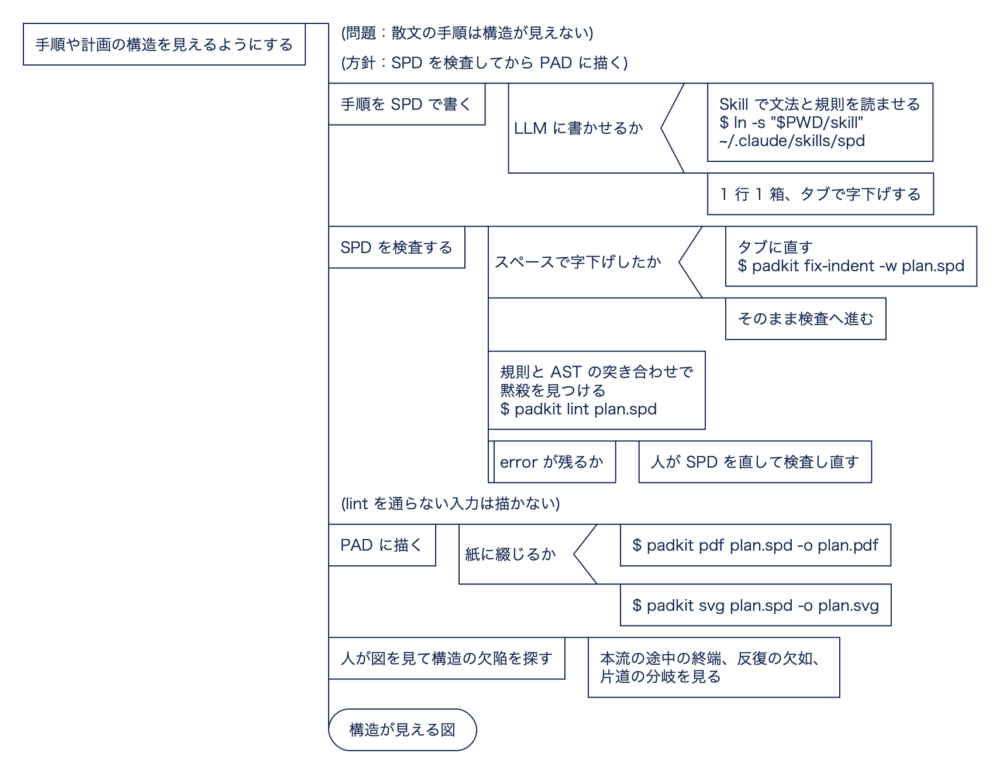
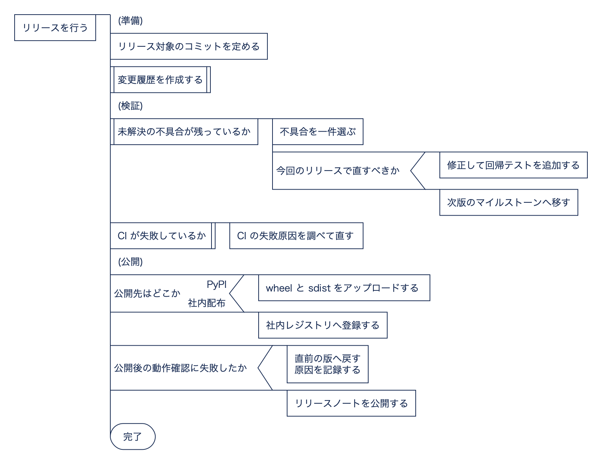
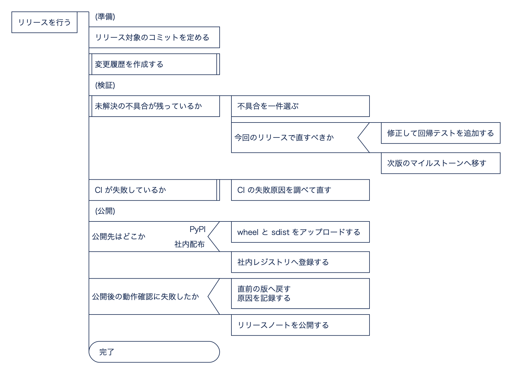

# padkit — SPD/PAD ツールチェーン

SPD（Simple PAD Description）で書いた手順・計画を PAD（Problem Analysis Diagram,
問題分析図）として検査・描画するツール群。

- **`padkit`**（CLI）: lint / SVG / PDF / AST。描画は [padtools_ts](https://github.com/steelpipe75/padtools_ts) を固定版で呼ぶ
- **`skill/`**（Claude Skill `spd`）: SPD の文法と規則を読み込み、LLM に正しい SPD を書かせる。計画・設計なら構造の欠陥も講評する

主眼は作図の省力化ではなく、**構造を見えるようにすること**にある。散文の手順や計画では、
入れ子・反復・分岐の構造は読み手が頭の中で組み立て直すしかない。PAD にすると、それが
2 次元の図としてそのまま見える。構造が見えれば、欠陥（本流の途中の終端、反復の欠如、
片道の分岐）も形のずれとして見えてくる。

## 考え方

何が問題で、それをどう解いているかを PAD（問題分析図）で示します。各段の詳細は下の各節を参照してください。



<sub>図の元は [`docs/pad/concept.spd`](docs/pad/concept.spd)。[padkit](https://github.com/mashi727/padkit) で検査・描画しています。</sub>

## PAD の考え方 — 原典から

PAD は日立製作所で発明され、1979 年に公表された図式である[^futamura]。その開発思想を、
二村良彦氏は「PADの開発」で次のように述べている。

> PADは構造化プログラム技法を実践しやすくするための「思考の道具」として，1980年に日立製作所によって提案された。
> — 二村 (1986), p.351

その背景にあるのは、人間の思考は文章より図式に近いという仮説である。

> ダイクストラなどが言葉によって示した構造化プログラム技法を，2次元的な図式により表わし，より実践しやすくしたものがPADである。「人間が計算手順を考えるときには，1次元的な言葉でよりも2次元的な図式に近い形で考えている。そして，プログラムを2次元的な図式で表現するほうが人間のもとの考えにより近い。」という仮説がPADの背景にある。
> — 二村 (1986), p.352

流れ図と比べた利点として、次の二つが挙げられている。

> 一方，PADでは基本形の結合の仕方はひと目で分かる。また，図4の手順ならばだれが書いても図5に示したとおりになる。すなわち，流れ図と比べるとPADには次の特徴がある。\
> (1) プログラムの構造が見やすい。\
> (2) 図の書き方に関する個人差が少ない。
> — 二村 (1986), p.353

### LLM の時代に PAD を使う理由（padkit の立場）

以下は原典の主張ではなく、padkit がそれをどう受け継ぐかの説明である。

- **1 次元の出力を 2 次元で読む。** LLM が出力するのは 1 次元の文章である。手順や計画を
  文章のまま渡されると、入れ子・反復・分岐の構造は読み手の頭の中で組み立て直すしかない。
  SPD はその文章を 1 行 1 箱の形に制約し、padkit がそれを PAD という 2 次元の図式に戻す。
  上の仮説が正しければ、人間はそのほうが内容を検証しやすい。
- **構造がひと目で分かれば、欠陥もひと目で分かる。** 原典のいう「結合の仕方」が見えると、
  本流の途中で角丸の終端が出てきたり、反復が一つも無かったりする欠陥が、形のずれとして現れる。
  `padkit lint` はそれを数えて、講評の材料（I301〜I303）として返す。
- **個人差が少ないので、比べられる。** 同じ構造なら誰が書いても同じ図になるので、
  LLM の出力を版ごと・モデルごとに図として比べられる。

[^futamura]: 二村良彦「PADの開発」『日立評論』Vol.68, No.5, pp.351–355（1986年5月）。
    <https://www.hitachihyoron.com/jp/pdf/1986/05/1986_05_02.pdf>

## 深さの列揃え — padkit の拡張

`--align-depth` を付けると、**同じ深さの箱を同じ列に揃える**。PAD の規格（原典の記法）には
ない、padkit 独自の拡張である。

標準の PAD では、子の位置が親の箱の幅で決まる。そのため同じ深さの箱でも、親の文字数が違えば
左右にずれる（下図の左）。`--align-depth` は、深さごとに最も幅の広い箱に合わせて、その深さの
箱をすべて同じ幅に伸ばす（右）。

| 標準 | `--align-depth` |
|---|---|
|  |  |

右の図では、**1 列が 1 段の詳細化**に対応する。原典は、PAD が支えるトップダウン作成法
（段階的詳細化）を、ダイクストラの指針として次のように紹介している。

> 「与えられた仕様（大仕様）に基づいてプログラムを作る際に，一つの大きなプログラムを一度に作ろうとしてはならない。まず，トップダウン的に考えて大仕様を幾つかの小さな仕様（小仕様）に分割する。そして，各小仕様に対するプログラム（サブプログラム）を作成する。そして，サブプログラムを統合して大仕様を満たすプログラムを完成させる」。
> — 二村 (1986), p.351

列を揃えると、この「分割の段」が縦に並ぶ。そのため次のことが見て分かる。

- **粒度の混在**：同じ列に「戦略を決める」と「メールを送る」が並べば、詳細化の段が揃っていない
- **分割の深さ**：列の数が、その手順を何段まで詳細化したかを示す（深すぎれば W201）
- **段どうしの比較**：複数の段階（Phase）を持つ計画で、同じ段の項目を横に見比べられる

代わりに、図の幅は各列の最大幅の和になる。`:comment` は枠が無いので伸ばさない。
`svg` と `pdf` の両方で使える。

```bash
padkit pdf plan.spd --align-depth -o plan.pdf
```

画像は `scripts/build_readme_images.sh` で作り直せる。

## なぜラッパーが要るのか

padtools_ts は次の入力を**エラーも警告も出さず、終了コード 0 で**誤った図にする
（固定コミットで実測）。

| 入力 | 描かれる図 |
|---|---|
| スペースで字下げ | 入れ子が全部消え、`:if` が文字列の箱になる |
| `:ifx 条件`（綴り違い） | `:if` として読み、子ブロックを捨てる |
| 処理ボックスの 2 文字目が `#`（`C# で書く`） | 次の行を同じ箱に取り込む |
| `:else  # コメント` | else 側を丸ごと捨てる |
| 最後の文が字下げされた 1 文字の箱 | その箱が消える |

`padkit lint` はこれらを個別の規則で error にし、さらに **padkit 自身のパーサで組んだ AST と
padtools_ts の AST を突き合わせて**、未知の黙殺も E900 として止める。`svg` / `pdf` / `ast` は
lint を通らない入力を描画しない。

## 導入

前提: Python ≥ 3.11、[uv](https://docs.astral.sh/uv/)、Node.js ≥ 22（npm）、cairo
（macOS: `brew install cairo` / Debian 系: `apt install libcairo2`）。

```bash
uv tool install .        # padkit コマンドを導入
padkit setup             # 固定版 padtools_ts の依存を npm ci で導入（初回のみ、約 94 MB）
padkit info              # 固定版・エンジンの場所・解決されたフォントを確認
```

開発時は `uv sync` のうえ `uv run padkit …`。エンジンの置き場所は既定で
`~/.cache/padkit/padtools_ts-<commit>`、`PADKIT_ENGINE_DIR` で変えられる。

## 使い方

```bash
padkit lint plan.spd                 # 構文・黙殺・講評観点。error があれば exit 1
padkit lint --strict plan.spd        # warning でも exit 1
padkit lint --format json plan.spd   # 統計と診断を JSON で（LLM への読み戻し用）
padkit fix-indent -w plan.spd        # スペース字下げをタブに直す（段の幅は自動推定）

padkit svg plan.spd -o plan.svg                  # house スタイル（navy, CJK ゴシック）
padkit svg plan.spd -o plan.svg --style mono     # padtools_ts の既定（monospace・黒）
padkit pdf plan.spd -o plan.pdf                  # 用紙と向きを自動選択
padkit pdf a.spd b.spd -o book.pdf --paper a3    # 複数の図を 1 冊に綴じる
padkit pdf plan.spd --align-depth                # 深さを列に揃える（上記）

padkit ast plan.spd -o plan.json                 # padtools_ts の AST
padkit svg --from-ast plan.json -o plan.svg      # AST から描画（往復）
padkit ast --oracle plan.spd                     # padkit 自身の解析結果
```

診断コードの一覧は [skill/reference/lint-codes.md](skill/reference/lint-codes.md)。

### スタイル

| 名前 | 書体 | 線・文字 | 線幅 |
|---|---|---|---|
| `house`（既定） | CJK ゴシック 13 | `#142850`（navy） | 1 |
| `mono` | monospace 14 | 黒 | 1 |
| `print` | CJK ゴシック 13 | 黒 | 1.6 |

CJK ゴシックは Noto Sans CJK JP → Noto Sans JP → Hiragino Sans → … の順に、
**インストール済みでかつ可変フォントでないもの**を選ぶ。cairo は可変フォントを既定インスタンス
で描くため、Noto Sans JP の可変版を選ぶと極細（Thin）になる。`--font-family` 等で個別に上書きできる。
余白・箱の内側余白は padtools_ts の CLI から変えられない。

### PDF の用紙

- 向きは図の縦横比で決める。用紙は A4 で縮小率が 0.7 未満になるなら A3 にする
- 既定では拡大しない（`--max-scale 1.0`）。複数ページで文字の大きさが揃う。紙面いっぱいにするなら `--max-scale 10`
- 余白は 36 pt（0.5 in）、`--margin` で変更
- フォントは PDF に埋め込まれる。フォントの無い環境でも同じ見た目になることをテストで確認している

## Skill の導入

`skill/` を Claude Code のスキル置き場へリンクする。

```bash
ln -s "$PWD/skill" ~/.claude/skills/spd    # /spd で起動
```

`skill/scripts/spd_lint.py` は padkit 無しで動く単体の linter（標準ライブラリのみ）。
`src/padkit/spd.py` と `lint.py` から生成しており、手で編集しない。

```bash
uv run python scripts/build_skill_lint.py    # 再生成（テストが鮮度を検査する）
```

## 開発

```bash
uv sync
uv run padkit setup
uv run pytest                    # エンジン未導入なら該当テストは skip
UPDATE_GOLDEN=1 uv run pytest    # golden SVG の更新
```

### padtools_ts の固定版を上げる

```bash
./scripts/vendor_padtools.sh <commit-sha>
uv run padkit setup --force
uv run pytest
```

`src/padkit/_vendor/padtools_ts/` には `dist/`・`package.json`・`package-lock.json`・LICENSE・
文法（`spd.langium`）だけを置き、`node_modules` は置かない。`PIN.json` にコミット、tarball の
SHA-256、適用したパッチを記録する。

padtools_ts への変更は `patches/*.patch` として持ち、vendor のたびに番号順に当て直す。
vendor 済みのファイルを直接編集しない。パッチが当たらなくなったら、新しい版に合わせて作り直す。

| パッチ | 内容 | 既定の出力 |
|---|---|---|
| `0001-align-depth.patch` | `--align-depth`（深さの列揃え） | 変えない |
| `0002-sequence-line-stops-at-shape.patch` | 順次処理の縦線が、最後の要素の図形を越えて子の部分木の下端まで伸びる不具合を直す | 縦線の終点だけ変わる |
| `0003-connector-reaches-terminal.patch` | 終端（角丸）へつなぐ横線が、角丸の手前で宙に浮いて終わる不具合を直す | 終端へつながる横線の終点だけ変わる |

0002 は upstream の描画の不具合で、分岐（`:if`/`:switch`）や子を持つ箱が列の最後にあると
縦線がはみ出す。0003 も upstream の不具合で、`:terminal` が子や分岐先の先頭にあると、横線が
外接矩形の角で止まり角丸に届かない。それぞれ `test_sequence_line_stops_at_the_branch_shape`、
`test_connector_reaches_rounded_terminal`（`tests/test_engine.py`）で検査している。

エンジンの `dist` は実行時に vendor 側と照合され、違えば自動で写し直される。
`package-lock.json` が変わったときだけ `padkit setup --force` が要る。

固定先は v0.4.0 タグではなく main のコミット `de37d5d` にしている。v0.4.0 は langium 化以前の
手書きパーサで、仕様の基準にした `spd.langium` を含まないため。

## 構成

```
src/padkit/
  spd.py        SPD パーサ（padtools_ts から独立。AST 突き合わせの基準）
  lint.py       講評観点の検査と出力
  engine.py     padtools_ts の導入・呼び出し・AST 比較
  presets.py    スタイルとフォント解決
  pdf.py        SVG → PDF、用紙フィット
  cli.py
  _vendor/padtools_ts/
skill/
  SKILL.md
  reference/    文法・講評観点・診断コード
  examples/
  scripts/spd_lint.py   （生成物）
tests/
  fixtures/ok/       正常系
  fixtures/broken/   1 行目の `# expect: E…` が期待する診断
  golden/            golden SVG
```

## ライセンス

MIT。padtools_ts（MIT, © 2025 steelpipe）を同梱している。[THIRD_PARTY_NOTICES.md](THIRD_PARTY_NOTICES.md) 参照。
